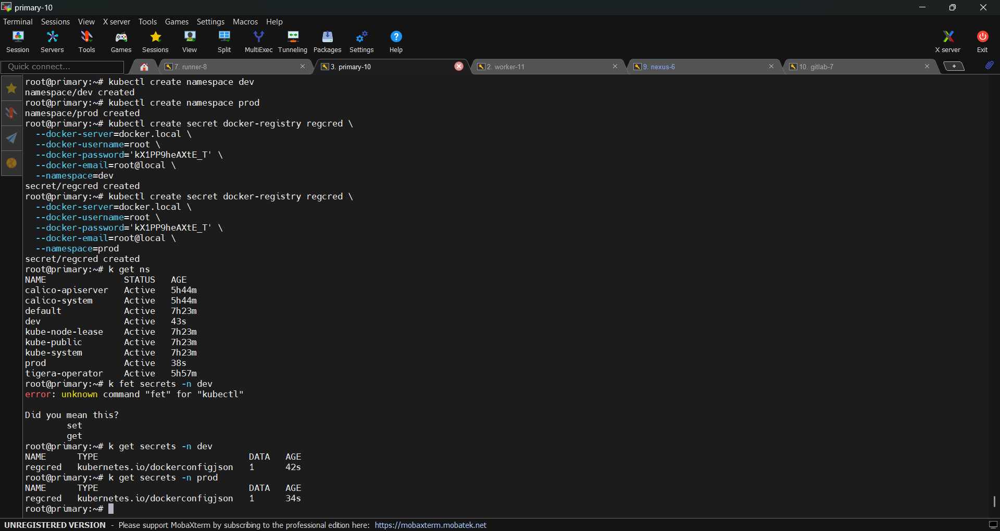

# The Task

based on my steps 
1. [nexus](../master/nexus.md/)
2. [gitlab](../master/gitlab.md/)
3. [runner](../master/gitlab.md/)
4. [kube](../master/kube.MD/)

My virtual machines will be like:


at first we need to define secret for our kube cluster:
```bash
#dev secret
kubectl create namespace dev
kubectl create secret docker-registry regcred \
  --docker-server=docker.local \
  --docker-username=root \
  --docker-password='kX1PP9heAXtE_T' \
  --docker-email=root@local \
  --namespace=dev

#prod secret
kubectl create namespace prod
kubectl create secret docker-registry regcred \
  --docker-server=docker.local \
  --docker-username=root \
  --docker-password='kX1PP9heAXtE_T' \
  --docker-email=root@local \
  --namespace=prod


```
these valuse are based on .env file



And change /etc/containerd/config.toml (on each node) to use local registry:
```bash
[plugins."io.containerd.grpc.v1.cri".registry.configs."docker.local".tls]
  insecure_skip_verify = true

systemctl restart containerd
```
 

manifest for dev:
```bash
apiVersion: v1
kind: Namespace
metadata:
  name: dev
---
apiVersion: v1
kind: ConfigMap
metadata:
  name: node-web-app
  namespace: dev
  labels:
    app: node-web-app
data:
  NODE_ENV: "development"
  MAINTAINER: "rfatolahzade"
---
apiVersion: v1
kind: Service
metadata:
  name: node-web-app
  namespace: dev
  labels:
    app: node-web-app
spec:
  type: ClusterIP
  selector:
    app: node-web-app
  ports:
    - name: http
      port: 8080
      targetPort: 8080
      protocol: TCP
---
apiVersion: apps/v1
kind: Deployment
metadata:
  name: node-web-app
  namespace: dev
  labels:
    app: node-web-app
spec:
  replicas: 1
  selector:
    matchLabels:
      app: node-web-app
  template:
    metadata:
      labels:
        app: node-web-app
    spec:
      imagePullSecrets:
        - name: regcred
      containers:
        - name: node-web-app
          image: docker.local/node-web-app:latest
          imagePullPolicy: IfNotPresent
          envFrom:
            - configMapRef:
                name: node-web-app
          ports:
            - name: http
              containerPort: 8080
              protocol: TCP
---
apiVersion: networking.k8s.io/v1
kind: Ingress
metadata:
  name: node-web-app
  namespace: dev
  labels:
    app: node-web-app
spec:
  ingressClassName: nginx
  rules:
    - host: "node-dev.local"
      http:
        paths:
          - path: /
            pathType: Prefix
            backend:
              service:
                name: node-web-app
                port:
                  number: 8080

```
manifest for prod:
```bash
apiVersion: v1
kind: Namespace
metadata:
  name: prod
---
apiVersion: v1
kind: ConfigMap
metadata:
  name: node-web-app
  namespace: prod
  labels:
    app: node-web-app
data:
  NODE_ENV: "production"
  MAINTAINER: "rfatolahzade"
---
apiVersion: v1
kind: Service
metadata:
  name: node-web-app
  namespace: prod
  labels:
    app: node-web-app
spec:
  type: ClusterIP
  selector:
    app: node-web-app
  ports:
    - name: http
      port: 8080
      targetPort: 8080
      protocol: TCP
---
apiVersion: apps/v1
kind: Deployment
metadata:
  name: node-web-app
  namespace: prod
  labels:
    app: node-web-app
spec:
  replicas: 1
  selector:
    matchLabels:
      app: node-web-app
  template:
    metadata:
      labels:
        app: node-web-app
    spec:
      imagePullSecrets:
        - name: regcred
      containers:
        - name: node-web-app
          image: docker.local/node-web-app:latest
          imagePullPolicy: IfNotPresent
          envFrom:
            - configMapRef:
                name: node-web-app
          ports:
            - name: http
              containerPort: 8080
              protocol: TCP
---
apiVersion: networking.k8s.io/v1
kind: Ingress
metadata:
  name: node-web-app
  namespace: prod
  labels:
    app: node-web-app
spec:
  ingressClassName: nginx
  rules:
    - host: "node.local"
      http:
        paths:
          - path: /
            pathType: Prefix
            backend:
              service:
                name: node-web-app
                port:
                  number: 8080


```
And the gitlab pipeline:
```bash
stages:
  - build-dev
  - test
  - deploy-dev
  - build-prod
  - deploy-prod

variables:
  IMAGE_NAME: "node-web-app"
  DOCKERLOCALREG_IMAGE: "docker.local/$IMAGE_NAME"

include:
  - local: 'ci/test.yml'

build-dev:
  stage: build-dev
  image: docker
  services:
    - name: docker:dind
      alias: docker
  variables:
    DOCKER_TLS_CERTDIR: ""
    DOCKER_HOST: "tcp://docker:2375"
  before_script:
    - echo "$DOCKERLOCALREG_PASS" | docker login -u "$DOCKERLOCALREG_USERNAME" --password-stdin docker.local
  script:
    - docker build -t "$DOCKERLOCALREG_IMAGE:$CI_PIPELINE_ID" .
    - docker push "$DOCKERLOCALREG_IMAGE:$CI_PIPELINE_ID"
  only:
    - dev

deploy-dev:
  stage: deploy-dev
  image: dtzar/helm-kubectl:3.18
  dependencies:
    - build-dev
  script:
    - mkdir -p ~/.kube && chmod 700 ~/.kube
  - echo "$KUBE_CONFIG_B64" | base64 -d > ~/.kube/config
    - kubectl create namespace dev --dry-run=client -o yaml | kubectl apply -f -
    - kubectl create secret docker-registry regcred \
        --docker-server=docker.local \
        --docker-username="$DOCKERLOCALREG_USERNAME" \
        --docker-password="$DOCKERLOCALREG_PASS" \
        --docker-email=not@set.local \
        --namespace=dev --dry-run=client -o yaml | kubectl apply -f -
    - sed -i "s/:latest/:$CI_PIPELINE_ID/g" deployment/dev/deploy.yaml
    - kubectl -n dev apply -f deployment/dev/deploy.yaml
  only:
    - dev

build-prod:
  stage: build-prod
  image: docker:24.0.2
  services:
    - name: docker:24.0.2-dind
      alias: docker
  variables:
    DOCKER_TLS_CERTDIR: ""
    DOCKER_HOST: "tcp://docker:2375"
  before_script:
    - echo "$DOCKERLOCALREG_PASS" | docker login -u "$DOCKERLOCALREG_USERNAME" --password-stdin docker.local
  script:
    - docker build -t "$DOCKERLOCALREG_IMAGE:$CI_COMMIT_TAG" .
    - docker push "$DOCKERLOCALREG_IMAGE:$CI_COMMIT_TAG"
  only:
    - master
    - tags

deploy-prod:
  stage: deploy-prod
  image: dtzar/helm-kubectl:3.18
  dependencies:
    - build-prod
  script:
    - mkdir -p ~/.kube && chmod 700 ~/.kube
  - echo "$KUBE_CONFIG_B64" | base64 -d > ~/.kube/config
    - kubectl create namespace prod --dry-run=client -o yaml | kubectl apply -f -
    - kubectl create secret docker-registry regcred \
        --docker-server=docker.local \
        --docker-username="$DOCKERLOCALREG_USERNAME" \
        --docker-password="$DOCKERLOCALREG_PASS" \
        --docker-email=not@set.local \
        --namespace=prod --dry-run=client -o yaml | kubectl apply -f -
    - sed -i "s/:latest/:$CI_COMMIT_TAG/g" deployment/prod/deploy.yaml
    - kubectl -n prod apply -f deployment/prod/deploy.yaml
  only:
    - tags
  when: manual

```
We have to add KUBE_CONFIGB64 as a variable.(I already added DOCKERLOCALREG_PASS & DOCKERLOCALREG_USERNAME)
```bash
base64 -w 0 ~/.kube/config
#copy the stdout and paste in value on gitlab variables
#via
#  - echo "$KUBE_CONFIG_B64" | base64 -d > ~/.kube/config
#we will encoded the config file.
```


After that on dev branch deploy will be automatically and on prod it will be manually.
 

