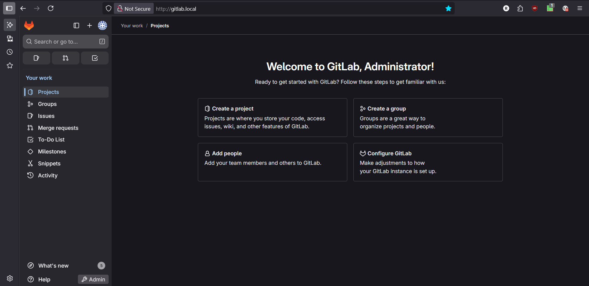
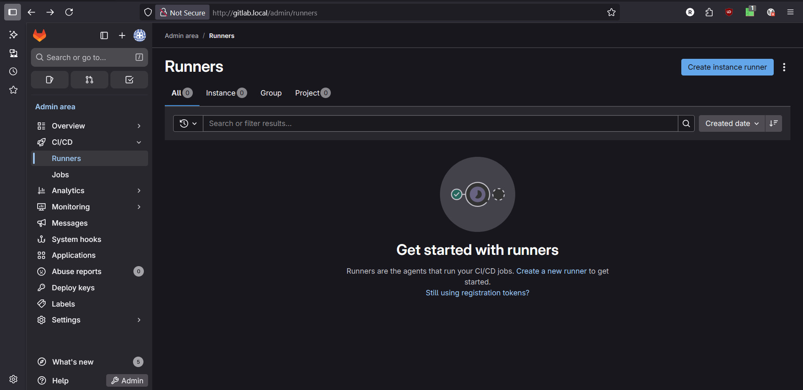
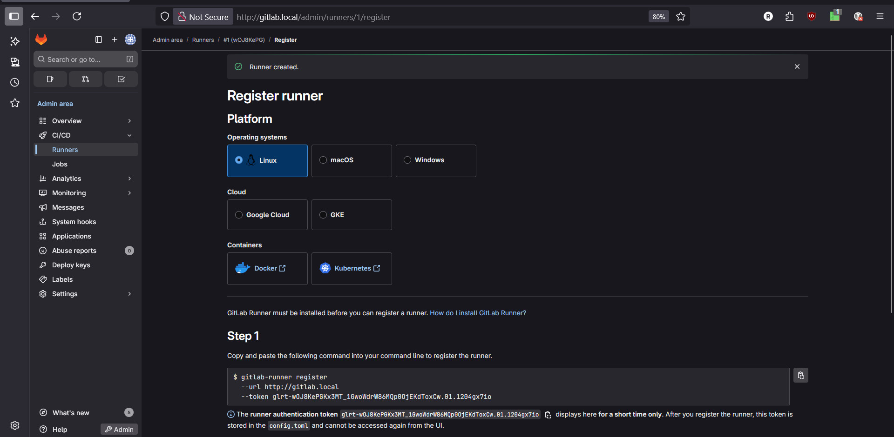
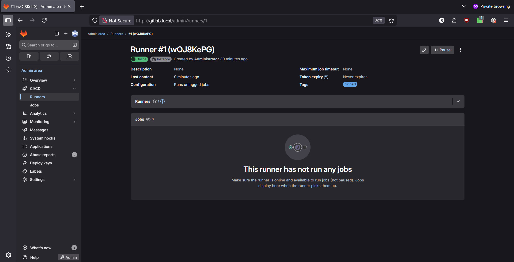
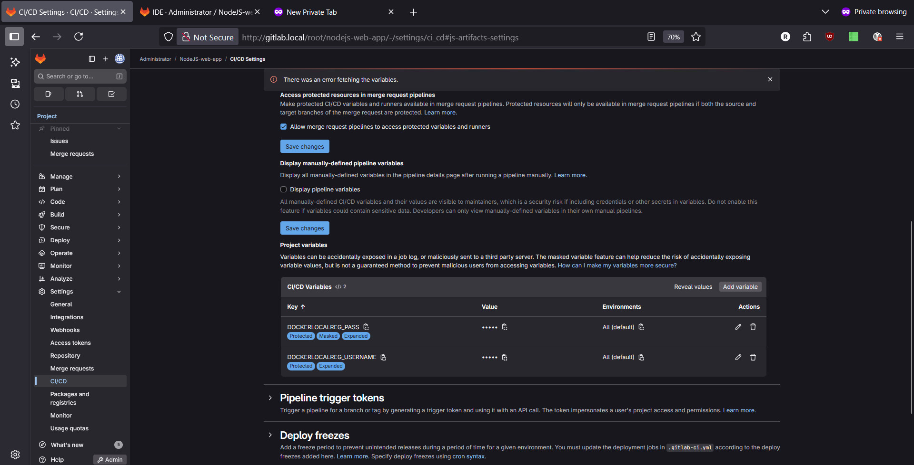
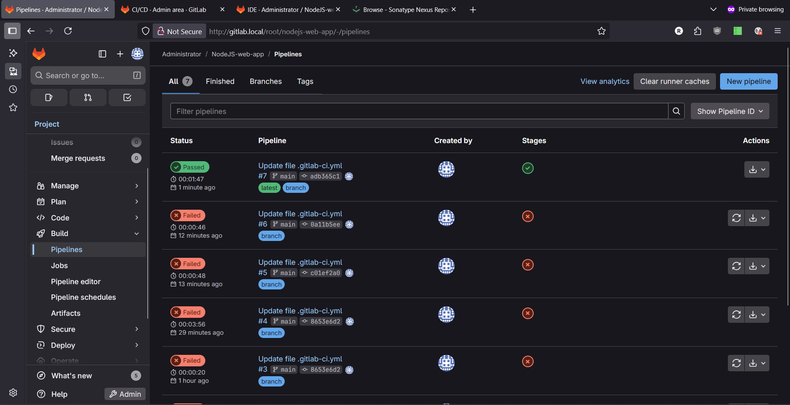
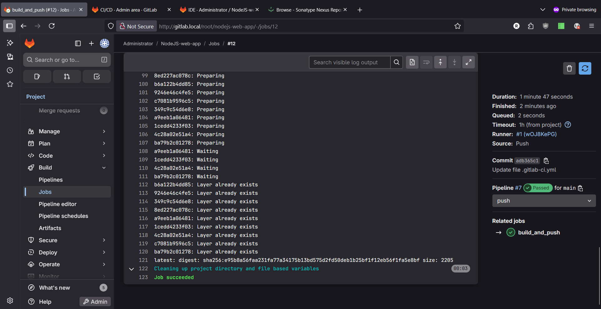
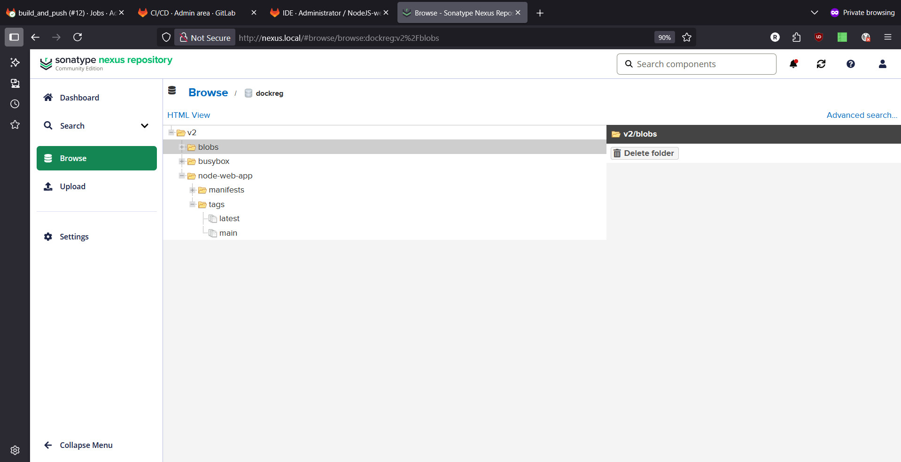

Dockerized gitlabce:

it contained:
redis,postgres,gitlab 

Create named volumes:
```bash
mkdir -p /Projects/gitlab/volumes/gitlab/{config,logs,data}
mkdir -p /Projects/gitlab/volumes/postgres/data
mkdir -p /Projects/gitlab/volumes/redis/data

# GitLab needs UID 1000, Postgres UID 999, Redis UID 999
chown -R 1000:1000 /Projects/gitlab/volumes/gitlab
chown -R 999:999 /Projects/gitlab/volumes/postgres
chown -R 999:999 /Projects/gitlab/volumes/redis

# GitLab
docker volume create --driver local \
  --opt type=none \
  --opt device=/Projects/gitlab/volumes/gitlab/config \
  --opt o=bind \
  gitlab-config

docker volume create --driver local \
  --opt type=none \
  --opt device=/Projects/gitlab/volumes/gitlab/logs \
  --opt o=bind \
  gitlab-logs

docker volume create --driver local \
  --opt type=none \
  --opt device=/Projects/gitlab/volumes/gitlab/data \
  --opt o=bind \
  gitlab-data

# Postgres
docker volume create --driver local \
  --opt type=none \
  --opt device=/Projects/gitlab/volumes/postgres/data \
  --opt o=bind \
  postgres-data

# Redis
docker volume create --driver local \
  --opt type=none \
  --opt device=/Projects/gitlab/volumes/redis/data \
  --opt o=bind \
  redis-data
  

```

Compose file:

```bash
ram@gitlab:~$ cat /Projects/gitlab/compose.yml
services:
  postgres:
    image: postgres:17.6-alpine3.22
    restart: always
    env_file: .env
    environment:
      - POSTGRES_USER=${POSTGRES_USER}
      - POSTGRES_PASSWORD=${POSTGRES_PASSWORD}
      - POSTGRES_DB=${POSTGRES_DB}
    volumes:
      - postgres-data:/var/lib/postgresql/data
    networks:
      - gitlab-network

  redis:
    image: redis:8.2.0-alpine
    restart: always
    command: redis-server --requirepass ${REDIS_PASSWORD}
    env_file: .env
    volumes:
      - redis-data:/data
    networks:
      - gitlab-network

  gitlab:
    image: gitlab/gitlab-ce:18.3.1-ce.0
    restart: always
    hostname: ${GITLAB_HOST}
    env_file: .env
    environment:
      GITLAB_OMNIBUS_CONFIG: |
        external_url 'http://${GITLAB_HOST}'
        gitlab_rails['db_adapter'] = 'postgresql'
        gitlab_rails['db_encoding'] = 'unicode'
        gitlab_rails['db_host'] = 'postgres'
        gitlab_rails['db_database'] = '${POSTGRES_DB}'
        gitlab_rails['db_username'] = '${POSTGRES_USER}'
        gitlab_rails['db_password'] = '${POSTGRES_PASSWORD}'
        gitlab_rails['redis_host'] = 'redis'
        gitlab_rails['redis_password'] = '${REDIS_PASSWORD}'
        gitlab_rails['initial_root_password'] = '${GITLAB_ROOT_PASSWORD}'
    ports:
      - "8929:80"
      - "443:443"
      - "${GITLAB_SSH_PORT}:22"
    volumes:
      - gitlab-config:/etc/gitlab
      - gitlab-logs:/var/log/gitlab
      - gitlab-data:/var/opt/gitlab
    networks:
      - gitlab-network
    depends_on:
      - postgres
      - redis

volumes:
  postgres-data:
    external: true
  redis-data:
    external: true
  gitlab-config:
    external: true
  gitlab-logs:
    external: true
  gitlab-data:
    external: true

networks:
  gitlab-network:
    driver: bridge
```


sample env:

```bash
# PostgreSQL configuration
POSTGRES_USER=gitlab
POSTGRES_PASSWORD=eHNo4SveNZCx
POSTGRES_DB=gitlab

# Redis configuration
REDIS_PASSWORD=bqn9C5DsJzzd

# GitLab configuration
GITLAB_HOST=gitlab.local
GITLAB_SSH_PORT=2222
GITLAB_ROOT_PASSWORD=kX1PP9heAXtE_T

```

after a while you can login via root as user and password (GITLAB_ROOT_PASSWORD in .env file)



Now lets define runner via gitlab panel:


and then click on "Create instance runner"


now lets setup runner via compose:

```bash
services:
  gitlab-runner:
    container_name: gitlab-runner
    restart: always
    hostname: gitlab-runner
    image: gitlab/gitlab-runner:alpine
    volumes:
      - /data/gitlab-runner/etc:/etc/gitlab-runner
      - /var/run/docker.sock:/var/run/docker.sock
      - /etc/hosts:/etc/hosts
    networks:
      - gitlab-network
networks:
  gitlab-network:
    name: gitlab-network


```

then we should run the command in previus image to register our runner to our gitlab, cuz we have runner as container we should run inside the runner container
```bash
root@gitlab:/data/gitlab-runner/etc# docker exec -it gitlab-runner  bash
gitlab-runner:/# gitlab-runner register
Runtime platform                                    arch=amd64 os=linux pid=22 revision=9ba718cd version=18.3.0
Running in system-mode.

Enter the GitLab instance URL (for example, https://gitlab.com/):
http://gitlab.local
Enter the registration token:
glrt-wOJ8KePGKx3MT_1GwoWdrW86MQp0OjEKdToxCw.01.1204gx7io
Verifying runner... is valid                        correlation_id=01K4A4WRY17TXNRGA6Q1YRZHBA runner=wOJ8KePGK
Enter a name for the runner. This is stored only in the local config.toml file:
[gitlab-runner]: runner
Enter an executor: ssh, parallels, docker-windows, kubernetes, instance, custom, shell, virtualbox, docker, docker+machine, docker-autoscaler:
docker
Enter the default Docker image (for example, ruby:3.3):
docker
Runner registered successfully. Feel free to start it, but if it's running already the config should be automatically reloaded!

Configuration (with the authentication token) was saved in "/etc/gitlab-runner/config.toml"
```

the config.toml will be:
```bash
root@gitlab:/data/gitlab-runner/etc# cat config.toml
concurrent = 1
check_interval = 0
shutdown_timeout = 0

[session_server]
  session_timeout = 1800

[[runners]]
  name = "runner"
  url = "http://gitlab.local"
  id = 1
  token = "glrt-wOJ8KePGKx3MT_1GwoWdrW86MQp0OjEKdToxCw.01.1204gx7io"
  token_obtained_at = 2025-09-04T10:38:26Z
  token_expires_at = 0001-01-01T00:00:00Z
  executor = "docker"
  [runners.cache]
    MaxUploadedArchiveSize = 0
    [runners.cache.s3]
    [runners.cache.gcs]
    [runners.cache.azure]
  [runners.docker]
    tls_verify = false
    image = "docker"
    privileged = false
    disable_entrypoint_overwrite = false
    oom_kill_disable = false
    disable_cache = false
    volumes = ["/cache"]
    shm_size = 0
    network_mtu = 0
root@gitlab:/data/gitlab-runner/etc# cat /Projects/runner/compose.yml
services:
  gitlab-runner:
    container_name: gitlab-runner
    restart: always
    hostname: gitlab-runner
    image: gitlab/gitlab-runner:alpine
    volumes:
      - /data/gitlab-runner/etc:/etc/gitlab-runner
      - /var/run/docker.sock:/var/run/docker.sock
      - /etc/hosts:/etc/hosts
    networks:
      - gitlab-network
networks:
  gitlab-network:
    name: gitlab-network
```

on gitlab panel:
 

we need to change config.toml on runner host as below:
```bash
cat /data/gitlab-runner/etc/config.toml
concurrent = 1
check_interval = 0
shutdown_timeout = 0

[session_server]
  session_timeout = 1800

[[runners]]
  name = "runner"
  url = "http://gitlab.local"
  id = 1
  token = "glrt-wOJ8KePGKx3MT_1GwoWdrW86MQp0OjEKdToxCw.01.1204gx7io"
  token_obtained_at = 2025-09-04T10:38:26Z
  token_expires_at = 0001-01-01T00:00:00Z
  executor = "docker"
  [runners.cache]
    MaxUploadedArchiveSize = 0
    [runners.cache.s3]
    [runners.cache.gcs]
    [runners.cache.azure]
  [runners.docker]
    pull_policy = "if-not-present"
    tls_verify = false
    image = "docker"
    privileged = false
    disable_entrypoint_overwrite = false
    oom_kill_disable = false
    disable_cache = false
    volumes = ["/var/run/docker.sock:/var/run/docker.sock", "/cache"]
    shm_size = 0
    network_mtu = 0
    network_mode = "host"

```

Now lets create simple pipeline to build and push to our local registry:

pipeline:

```bash
stages:
  - build
  - push

variables:
  IMAGE_NAME: "node-web-app"
  DOCKERLOCALREG_IMAGE: "docker.local/$IMAGE_NAME"

build_and_push:
  image: docker:latest
  stage: push
  services:
    - docker:dind
  variables:
    DOCKER_TLS_CERTDIR: ""
  before_script:
    # Login to Local Reg
    - echo "$DOCKERLOCALREG_PASS" | docker login -u "$DOCKERLOCALREG_USERNAME" --password-stdin docker.local
  script:
    # Build the image
    - docker build -t "$DOCKERLOCALREG_IMAGE:$CI_COMMIT_REF_SLUG" .
    
    # Tag for Local Reg
    - docker tag "$DOCKERLOCALREG_IMAGE:$CI_COMMIT_REF_SLUG" "$DOCKERLOCALREG_IMAGE:latest"

    # Push to Docker Local Reg
    - docker push "$DOCKERLOCALREG_IMAGE:$CI_COMMIT_REF_SLUG"
    - docker push "$DOCKERLOCALREG_IMAGE:latest"
  only:
    - main
 #   - tags


```
Define variables on gitlab panel:
 

The result:
 

some detail:
 

on nexus panel:
 


