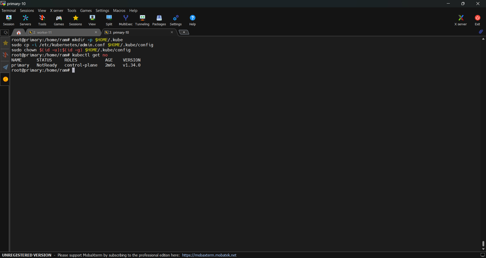

# Kubernetes cluster
I just install the kubernetes cluster via this  [article](https://github.com/InfrastructureFighters/cicd-students/blob/main/milad-norouzi/k8s/install_kubernetes.md)
kubernetes version: 1.34
just these changes:
```bash
curl -fsSL https://pkgs.k8s.io/core:/stable:/v1.34/deb/Release.key | sudo gpg --dearmor -o /etc/apt/keyrings/kubernetes-apt-keyring.gpg
  
  
  # This overwrites any existing configuration in /etc/apt/sources.list.d/kubernetes.list
echo 'deb [signed-by=/etc/apt/keyrings/kubernetes-apt-keyring.gpg] https://pkgs.k8s.io/core:/stable:/v1.34/deb/ /' | sudo tee /etc/apt/sources.list.d/kubernetes.list

```
and initialization the cluster via:
```bash
kubeadm init --control-plane-endpoint 192.168.1.10 --apiserver-advertise-address=192.168.1.10 --pod-network-cidr=192.168.0.0/16

```

Steps as below:
Turn off swap permanently:


Hosts file:


Install docker,containerd ,...


Staus:


SystemdGroup ture:


Load overlay and netfilter module:


Enable net.ipv4.ip_forward:


Add keyring to install kubeadm,kubelet,kubectl:


Status of nodes before install cni:



Join the worker to cluster (in my case single node)


Access to cluster locally:


Install CNI (Calico):


in some case like inistall calico,or pulling images , we should pull images on other servers and save them and then import them via ctr cli


sample solution:
```bash
#List images based on your kubernetes veriosn:
kubeadm config images list --kubernetes-version=v1.34.0
#Create dir to save tar files:
mkdir k8s-images
for img in $(kubeadm config images list --kubernetes-version=v1.34.0); do
    file=$(echo $img | tr '/:' '_').tar
    docker save -o k8s-images/$file $img
done
#import them on primary node and worker node based on your failure via this command:
for tar in k8s-images/*.tar; do
    ctr -n k8s.io images import $tar
done

#list of imported images:
ctr -n k8s.io images ls | grep registry.k8s.io

```


