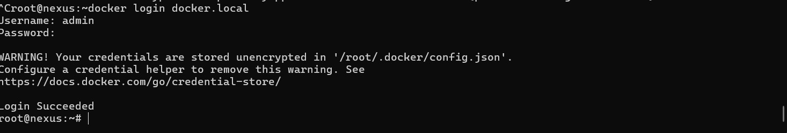
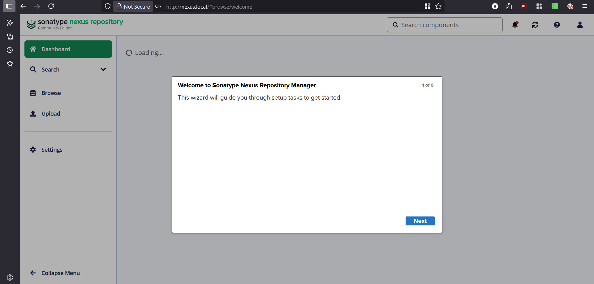
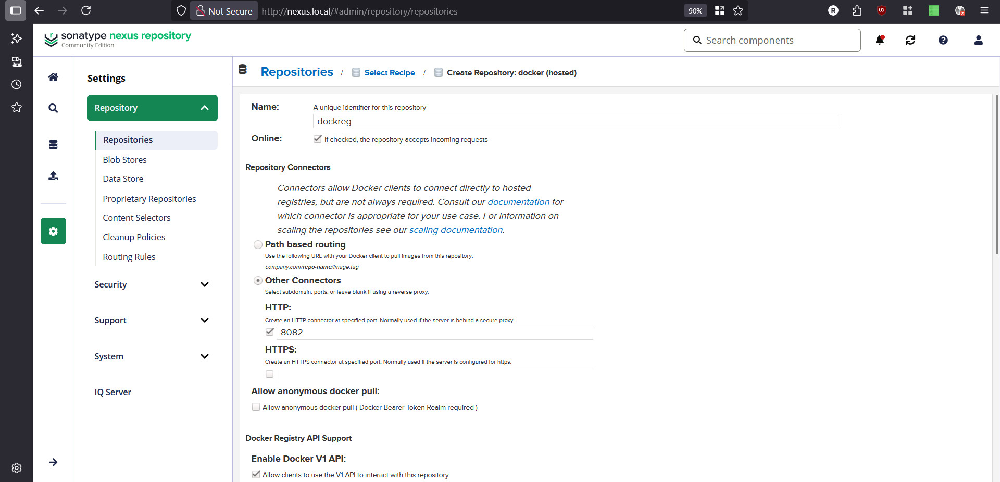
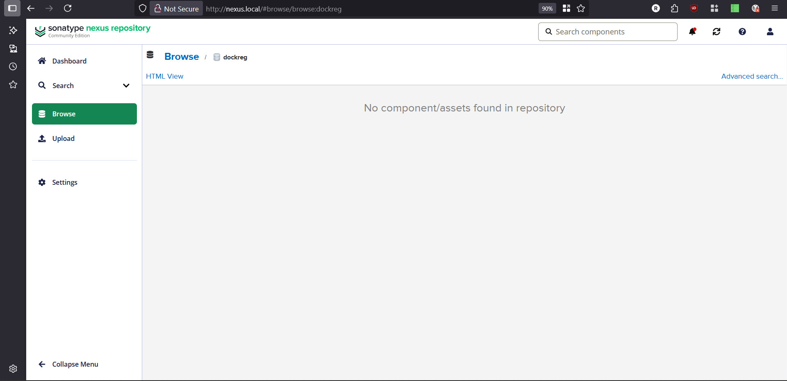
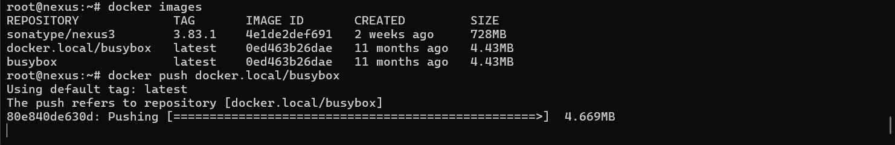
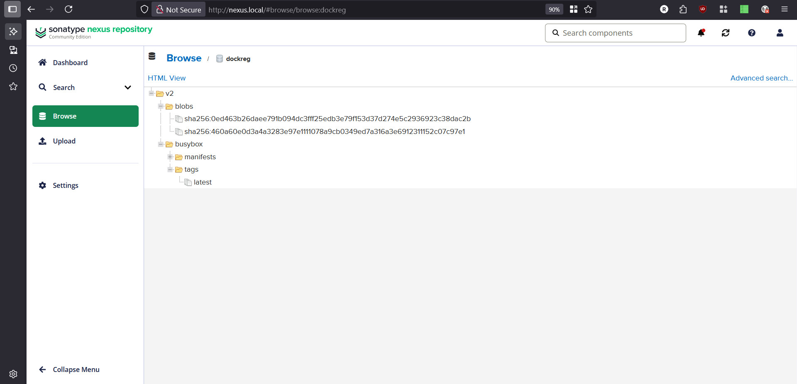

# gitlab-final
## Nexus
config files:

#### compose:
```bash
root@nexus:/Projects/nexus# cat compose.yml
services:
  nexus:
    container_name: "nexus_container"
    hostname: "nexus_container"
    restart: always
    image: sonatype/nexus3:3.83.1
    ports:
      - '127.0.0.1:8081:8081'
      - '127.0.0.1:8082:8082'
    environment:
      - nexus-webapp-context-path=/nexus
    volumes:
    - /data/registry/nexus-data:/nexus-data
```
fix volume permission:
```bash
chown 200:200 /data/registry/nexus-data -R
```

#### nginx configs:
for  admin panel
```bash
root@nexus:/Projects/nexus# cat /etc/nginx/conf.d/nexus.conf
server {
    listen 80;
    server_name nexus.local;
    location / {
        proxy_pass http://localhost:8081;
        proxy_set_header Host $host;
        proxy_set_header X-Real-IP $remote_addr;
        proxy_set_header X-Forwarded-For $proxy_add_x_forwarded_for;
        proxy_set_header X-Forwarded-Proto $scheme;
    }
}

```
for docker registry:
```bash
root@nexus:/Projects/nexus# cat /etc/nginx/conf.d/docker.conf
server {
    listen 80;
    client_max_body_size 7000M;
    server_name docker.local;
    location / {
        proxy_pass http://localhost:8082;
        proxy_set_header Host $host;
        proxy_set_header X-Real-IP $remote_addr;
        proxy_set_header X-Forwarded-For $proxy_add_x_forwarded_for;
        proxy_set_header X-Forwarded-Proto $scheme;
    }
}
```
cuz we havent TLS for our services, we have to set insecure registries in docker daemon json file and below:
```bash
root@nexus:/Projects/nexus# cat /etc/docker/daemon.json
{
   "insecure-registries" : ["docker.local"]
}
```
Our hosts file will be:
```bash
root@nexus:/Projects/nexus# cat /etc/hosts
127.0.0.1 nexus
127.0.0.1 nexus.local
127.0.0.1 docker.local
```
test login:

user: admin and password will be in "/nexus-data/admin.password"



Lets checkout the Nexus panel:



define our hosted docker reg:



its empty for now:



push an image:



in the panel:



